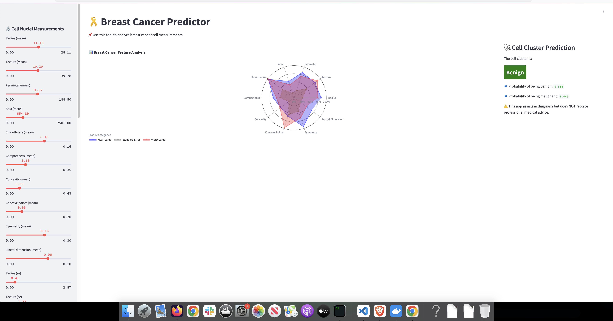

# Breast Cancer Prediction App




This is a **Streamlit web application** for predicting breast cancer diagnosis based on **cell nuclei measurements**. The app uses **machine learning** to classify tumors as **benign** or **malignant** based on user-inputted feature values. It includes **interactive sliders**, a **radar chart visualization**, and a **Dockerized deployment**.

## 🚀 Features
- 📊 **Interactive UI** with real-time feature selection
- 🎨 **Radar chart visualization** of feature distribution
- 🔬 **Machine Learning-powered predictions** (SVM, Random Forest, etc.)
- 🩺 **Probability estimates** for benign/malignant classification
- 🐳 **Fully Dockerized** for easy deployment

## 🛠️ Installation & Setup

### 1️⃣ Clone the Repository
```bash
git clone https://github.com/your-username/breast-cancer-app.git
cd breast-cancer-app
```

### 2️⃣ Install Dependencies
```bash
pip install -r requirements.txt
```

### 3️⃣ Run the App
```bash
streamlit run app/app.py
```
Open **http://localhost:8501** in your browser.

---

## 🐳 Running with Docker

### 1️⃣ Build the Docker Image
```bash
docker build -t breast-cancer-app .
```

### 2️⃣ Run the Container
```bash
docker run -p 8501:8501 breast-cancer-app
```

Now open **http://localhost:8501** to access the app.

---

## 📂 Project Structure
```
/breast-cancer-app
│── app
│   ├── app.py             # Streamlit application
│   ├── data.csv           # Breast cancer dataset
│   ├── model.pkl          # Pretrained ML model
│   ├── scaler.pkl         # Scaler for feature normalization
│   └── style.css          # Custom styling
│── requirements.txt       # Python dependencies
│── Dockerfile             # Docker instructions
│── .devcontainer/         # GitHub Codespaces configuration
```

---


---

## 🔗 References
- [Streamlit Documentation](https://docs.streamlit.io/)
- [Docker Documentation](https://docs.docker.com/)
- [Scikit-learn Documentation](https://scikit-learn.org/stable/)

---

## 📜 License
This project is licensed under the **MIT License**.

