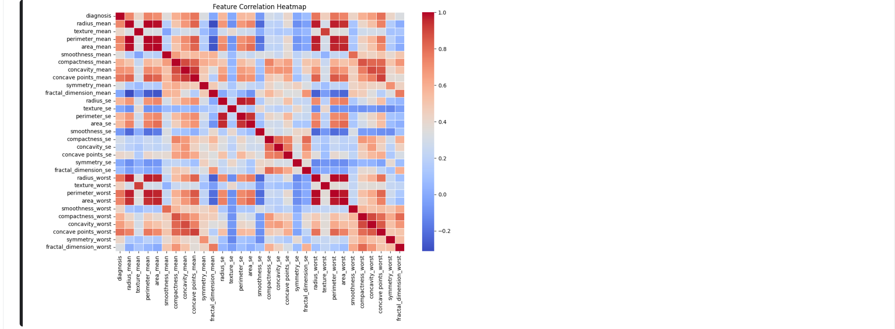
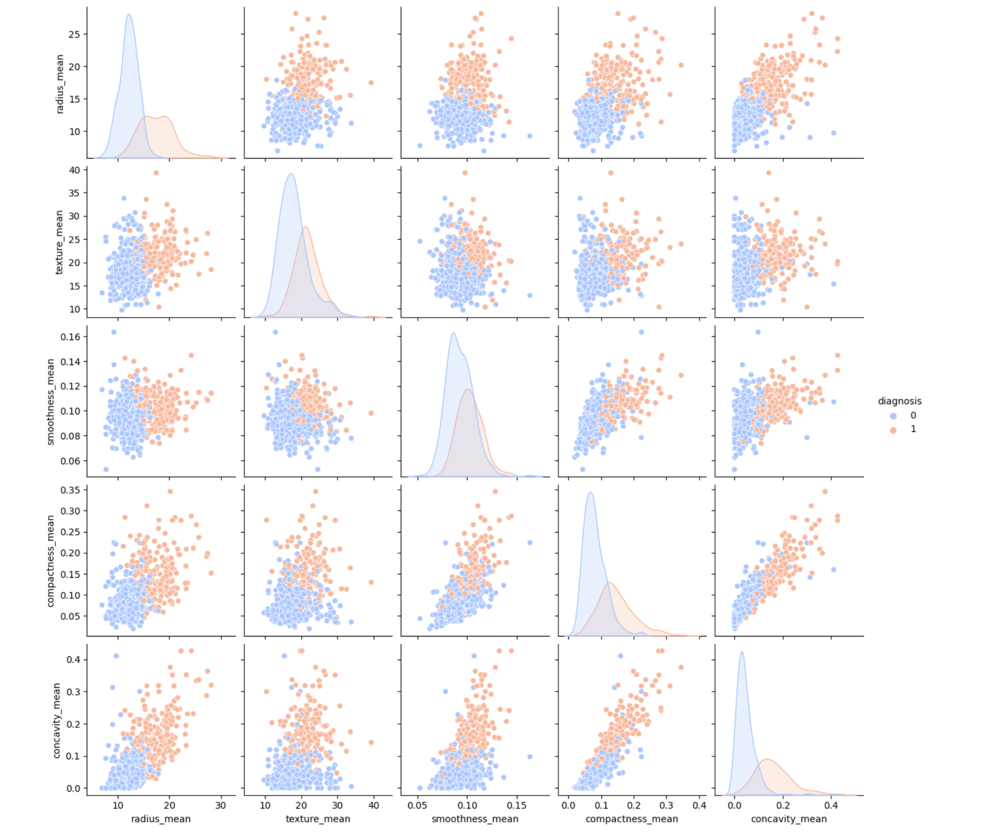

# Cancer Prediction App



should remove the redundant features (radius_mean, perimeter_mean, area_mean), as they contain overlapping infos.

Features like radius_mean, concavity_mean, and compactness_mean are strong indicators of malignancy


This is a **Streamlit web application** for predicting breast cancer diagnosis based on **cell nuclei measurements**. The app uses **machine learning** to classify tumors as **benign** or **malignant** based on user-inputted feature values. It includes **interactive sliders**, a **radar chart visualization**, and a **Dockerized deployment**.

## 🚀 Features
- 📊 **Interactive UI** with real-time feature selection
- 🎨 **Radar chart visualization** of feature distribution
- 🔬 **Machine Learning-powered predictions** (SVM, Random Forest, etc.)
- 🩺 **Probability estimates** for benign/malignant classification
- 🐳 **Fully Dockerized** for easy deployment

## 🛠️ Installation & Setup

### 1️⃣ Clone the Repository
```bash
git clone https://github.com/42nenuser/breast-cancer-app.git
cd breast-cancer-app
```

## 🐳 Running with Docker

### 1️⃣ Build the Docker Image
```bash
docker build -t breast-cancer-app .
```

### 2️⃣ Run the Container
```bash
docker run -p 8501:8501 breast-cancer-app
```

